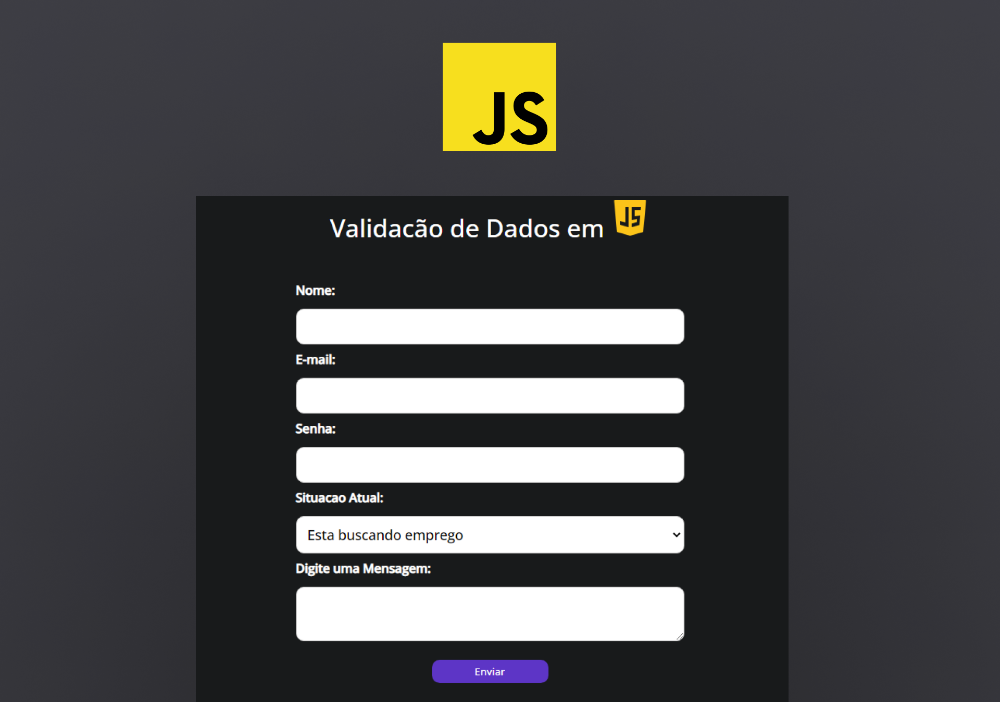

<h1 align="center"> <b>Form de Validação</b> </h1>

Formulario de Validação desenvolvido em Javascript  

  <a href="#-tecnologias">Tecnologias</a>&nbsp;&nbsp;&nbsp;|&nbsp;&nbsp;&nbsp;
  <a href="#-projeto">Projeto</a>&nbsp;&nbsp;&nbsp;|&nbsp;&nbsp;&nbsp;
  <a href="#-layout">Layout</a>
 

 

  

## 🚀 Tecnologias

Esse projeto foi desenvolvido com as seguintes tecnologias:

- HTML e CSS
- JavaScript

## 💻 Projeto

Formulario com Validação de Dados em Javascript.

- [Projeto Finalizado]()

--

Feito com ♥ by Gabriel